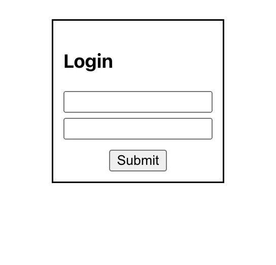
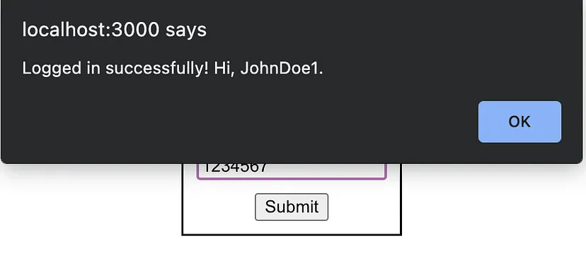
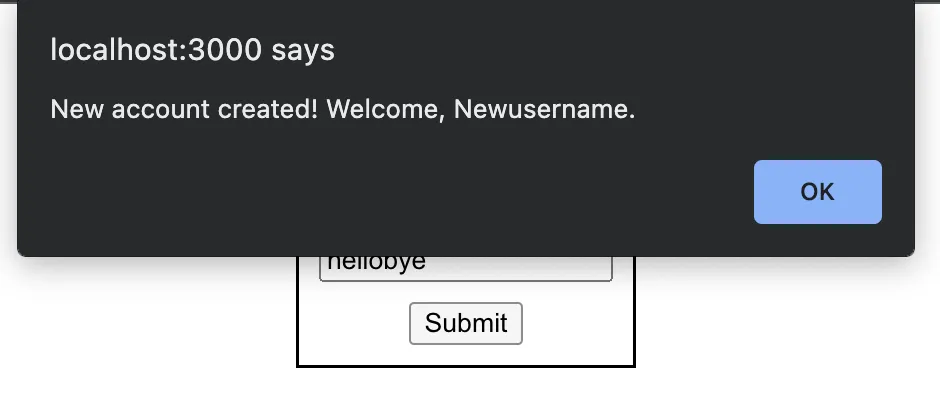
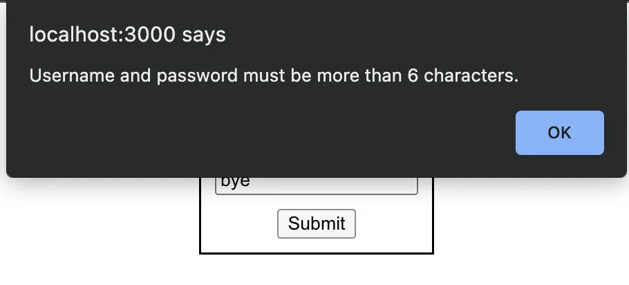

Write a functional component that imitates a log-in process. The component should be a form consisting of two input fields — for username and password — and a login button beneath them.

A login form with username and password slots and a submit button
The final product
When the user selects Submit or hits enter, the form should check if the username and password entered match some user stored in the component’s state. If so, an alert should appear including the user’s username (as shown below), and the component should reset to its starting state.

Alert displayed after successful login
If the username and password entered do not match an existing count, then (so long as each field is more than six characters long) create a new account, store it for future log-ins, and display an alert to notify the user. Just as the form does on successful login, it should clear the input fields following the alert.

Creating a new account from user input
If the username and/or password entered is less than six characters, do not create a new account, and display an alert explaining the issue. Do not clear the input fields so that the user may append to what they have already entered:

Alert displayed when the username and/or password is too short
Finally, the user should not be allowed to input more than 20 characters in either field. If the user attempts to add a 21st character to their input, do not reflect their change, and display the error in an alert:

[Live code here](https://stackblitz.com/edit/react-ts-5bxum1?file=App.tsx)